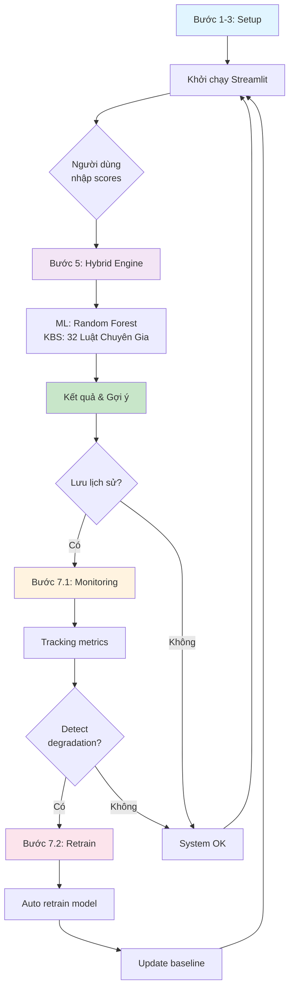

# Hệ Thống Gợi Ý Ngành Học Thông Minh - Phiên Bản 3.0

Hybrid Career AI System - Kiến trúc 2 Khối (KHTN/KHXH)
Giúp học sinh Việt Nam tìm ngành học phù hợp dựa trên điểm thi và luật chuyên gia

## Tính Năng Nổi Bật

| Tính Năng | Chi Tiết |
|-----------|---------|
| **Kiến Trúc** | 2 khối: KHTN (5 ngành) + KHXH (4 ngành), 2 model ML riêng |
| **Machine Learning** | Random Forest × 2, 6 features per khối, Dữ liệu từ THPT 2024 |
| **KBS - Luật Chuyên Gia** | ~20 luật/khối (JSON config) + Conflict Resolution + Specificity |
| **Hybrid Fusion** | 60% ML Score + 40% KBS Score, với VETO mechanism |
| **VETO Mechanism** | KBS phủ quyết kết quả ML khi phát hiện bất hợp lý (môn chính < 4.0) |
| **Giao Diện** | Streamlit: Chọn khối → Nhập điểm → Xem kết quả + Giải thích |
| **Dữ Liệu** | KHTN: toan, van, anh, ly, hoa, sinh | KHXH: toan, van, anh, lich_su, dia_ly, gdcd |
| **Config** | rules_config.json: Thresholds, scores, specificity ← dễ cập nhật |
| **Fallback** | Nếu ML unavailable → 100% KBS |
| **Logging** | Prediction tracking + Performance monitoring |

---

##  Cấu Trúc Dự Án - v3.0

```
e:/KBS/

 CORE MODULES
  app.py                     Giao diện Streamlit: Chọn khối → Nhập điểm → Xem kết quả
  hybrid_fusion.py           Kết hợp: 60% ML + 40% KBS + VETO (ENGINE CHÍNH)
  knowledge_rules.py         Luật từ JSON config (json-based, dễ cập nhật)
  config.py                  Cấu hình: 2 khối (KHTN/KHXH), 6 features/khối, paths

 TRAINING & DATA
  train_model.py             Huấn luyện 2 model RF (KHTN + KHXH) từ CSV
  diem_thi_thpt_2024.csv     Dữ liệu gốc THPT 2024 (~65MB)
  data_khtn.csv              Dữ liệu xử lý KHTN (auto-generate/update)
  data_khxh.csv              Dữ liệu xử lý KHXH (auto-generate/update)
  rf_model_khtn.pkl          Random Forest model KHTN (auto-gen)
  rf_model_khxh.pkl          Random Forest model KHXH (auto-gen)

 KBS RULES & CONFIG (v3.0)
  rules_config.json          Cấu hình luật JSON: ~20 luật/khối, thresholds, scores, specificity
  
 ANALYSIS & EVALUATION (v3.0)
  evaluate_model.py          So sánh ML vs Hybrid trên mỗi khối
  experiments.py             Thử nghiệm: weight tuning, khối thí nghiệm
  test_hybrid_fusion.py      Unit tests cho hybrid fusion engine
  
 MONITORING & AUTO-RETRAIN (v1.2)
  monitoring.py              Performance tracking & prediction logging
  retrain_pipeline.py        Tự động phát hiện và retrain model + quy trình cập nhật KBS

 TESTING
  test_hybrid_fusion.py      Unit tests cho hybrid fusion (KBS, ML, Hybrid, Ranking)

 DOCUMENTATION
  README.md                 Hướng dẫn chính (file này)
  DATASET.md                Mô tả dữ liệu: 160,000 mẫu + noise, 10 features, 8 classes
  KNOWLEDGE_BASED_RULES.md  32 luật + Forward Chaining + Conflict Resolution

 CONFIGURATION
  requirements.txt           Danh sách thư viện Python
  .gitignore                 Git ignore file
```

---

## Kiến Trúc Hệ Thống - Chi Tiết

### 1. Tổng Quan Hệ Thống

```
Đầu Vào (10 Điểm Môn Học)
    │
    ├─────────────────────────────────────────────────┐
    │                                                 │
    ↓                                                 ↓
NHÁNH MACHINE LEARNING                    NHÁNH LUẬT CHUYÊN GIA
Random Forest (74.61%)                 32 Luật + Forward Chaining (40%)
    │                                 + Conflict Resolution
    │                                                 │
    ├─────────────────────────────────────────────────┤
    │                                                 │
    └──────────── HỢP NHẤT HYBRID ──────────────────┘
              (0.6 × ML + 0.4 × KBS)
               KBS Case Study: 95% Chính xác
                        │
                        ↓
                  ĐẦU RA: Xếp Hạng
              (0-100% điểm cho mỗi ngành)
```

### 2. Chi Tiết Luồng Dữ Liệu

#### LỚPĐẦU VÀO
```
Giao Diện Streamlit (app.py)
├─ 10 thanh trượt (môn học): Toán, Lý, Hóa, Sinh, Văn, Anh, Lịch sử, Địa lý, Tin, GDCD
├─ Khoảng: 0-10 điểm mỗi môn
└─ Đầu Ra: Mảng [float × 10] phạm vi [0, 10]
```

#### LỚPXỬ LÝ MACHINE LEARNING
```
Cấu Hình (config.py)
├─ RF_PARAMS: n_estimators=100, max_depth=15, n_jobs=-1
└─ Tải: rf_model.pkl (mô hình RF đã huấn luyện)

Random Forest (hybrid_fusion.py → calculate_ml_score)
├─ Đầu Vào: Điểm raw [0,10] (không normalize, model train trên [3,10])
├─ Quá Trình:
│  ├─ Đi qua 100 cây (song song)
│  ├─ Bỏ phiếu cây: Mỗi cây dự đoán lớp (0-7)
│  └─ Đầu Ra: predict_proba → xác suất mỗi lớp
├─ Temperature Scaling: adjusted = probs^(1/T) / sum(probs^(1/T)), T=0.5
├─ Baseline Adjust: (adjusted[i] - 1/8) / (1 - 1/8) × 100
└─ Kết Quả: ML_Score (0-100%)
           Ví Dụ: prob=0.93 → adjusted=0.99 → ML_Score=99.8%
```

#### LỚPXỬ LÝ LUẬT CHUYÊN GIA (KBS)
```
Hệ Thống Luật Chuyên Gia (knowledge_rules.py)
├─ Đầu Vào: 10 điểm môn học [0-10]
│
├─ 32 Luật Cơ Sở (4 luật × 8 ngành) + specificity:
│  ├─ IT:       Toán≥8 AND Tin≥8 AND Lý≥7 → 95% (spec=3)
│  ├─ Y Khoa:   Sinh≥8.5 AND Hóa≥8 AND Văn≥7 → 95% (spec=3)
│  ├─ Kỹ Thuật: Toán≥8 AND Lý≥8 AND Hóa≥7 → 92% (spec=3)
│  └─ ... (8 ngành × 4 mức)
│
├─ Forward Chaining (10 luật chuỗi):
│  ├─ IT_Quoc_Te: IT match + Anh≥7 → +3 bonus
│  ├─ YKhoa_QuocTe: YKhoa match + Anh≥7.5 → +3 bonus
│  └─ ... (suy luận chuyên ngành phụ)
│
├─ Conflict Resolution:
│  ├─ Ưu tiên 1: Specificity cao (nhiều điều kiện)
│  └─ Ưu tiên 2: Score cao
│
├─ Đầu Ra: KBS_Score (0-100%) + chain_details
└─ Tính Chất: Độc lập ML, Giải thích được, rules_config.json
```

#### LỚPHỢP NHẤT HYBRID
```
Kết Hợp Trọng Số (hybrid_fusion.py)
├─ ML_Score:  Từ Random Forest (0-100%)
├─ KBS_Score: Từ 32 Luật Chuyên Gia (0-100%)
│
├─ Công Thức Hybrid:
│  Hybrid_Score = 0.6 × ML_Score + 0.4 × KBS_Score
│
├─ Ví Dụ IT Specialist (Toán:9, Tin:9.5, Anh:8, ...):
│  • ML_Score: 41.7% (RF predict_proba + temperature scaling)
│  • KBS_Score: 83% (IT_Fit + Forward Chain IT_Quoc_Te +3)
│  • Hybrid: 0.6×41.7 + 0.4×83 = 25.0 + 33.2 = 58.2%
│
└─ Fallback: Nếu ML không khả dụng → Hybrid = 100% KBS
```

#### LỚPĐẦU RA
```
Giao Diện Streamlit (app.py)
├─ Tab 1 (Kết Quả Chính):
│  ├─ 5 Metrics: Ngành, Hybrid Score, ML Score, KBS Score, Mức khuyến nghị
│  ├─ Công thức: 60% ML + 40% KBS = Hybrid
│  └─ Giải thích chi tiết (rule name, reason, chain)
│
├─ Tab 2 (Phân Tích Chi Tiết):
│  ├─ Radar Chart: 10 môn học
│  └─ Bảng thống kê: điểm + xếp hạng từng môn
│
└─ Tab 3 (So Sánh Ngành):
   ├─ Bar Chart: Hybrid vs ML vs KBS cho 8 ngành
   ├─ Bảng xếp hạng
   └─ Expander chi tiết từng ngành
```

### 3. Kiến Trúc Mô-đun

```
app.py (Giao Diện UI)
│
├─ config.py (Cài Đặt)
│   ├─ RF_PARAMS: {n_estimators: 100, max_depth: 15}
│   ├─ NGANH_HOC_MAP: {0: 'IT', 1: 'Kinh tế', ...}
│   ├─ FEATURE_NAMES: ['Toán', 'Lý', 'Hóa', ...]
│   └─ Đường Dẫn tới Mô Hình & Dữ Liệu
│
├─ hybrid_engine.py (Adapter - AI Cốt Lõi)
│   ├─ load_model(): Tải rf_model.pkl
│   ├─ get_hybrid_advice(): Hợp Nhất ML + KBS (wrapper)
│   ├─ get_all_majors_ranking(): Xếp Hạng 8 Ngành
│   └─ Fallback: Nếu hybrid_fusion không có, dùng fuzzy cũ
│
├─ hybrid_fusion.py (Hybrid Engine - THỰC THI CHÍNH)
│   ├─ calculate_ml_score(): Tính điểm ML từ RF
│   ├─ calculate_kbs_score(): Tính điểm KBS từ 32 luật
│   ├─ calculate_hybrid_score(): Hợp nhất 0.6×ML + 0.4×KBS
│   ├─ get_hybrid_ranking(): Xếp hạng toàn bộ 8 ngành
│   └─ normalize_scores(): Clip điểm về [0,10] (không normalize)
│
├─ knowledge_rules.py (32 Luật Chuyên Gia KBS)
│   ├─ KnowledgeRuleEngine: Lớp chính
│   ├─ _rules_IT(), _rules_YKhoa(), ... (8 methods)
│   ├─ evaluate(): Kiểm tra luật cho một ngành
│   └─ get_ranking(): Xếp hạng theo luật
│
├─ rule_extraction.py (Giải Thích)
│   ├─ Trích Xuất Top 50 Luật từ RF
│   ├─ Định Dạng: "NẾU (Toán >= 7.5) VÀ (Tin >= 7.5) THÌ IT"
│   └─ Chỉ Số Hỗ Trợ & Độ Tin Cậy
│
├─ evaluate_model.py (Xác Thực)
│   ├─ So Sánh Hiệu Năng ML vs Hybrid
│   ├─ Điểm Xác Thực Chéo
│   ├─ Chỉ Số Từng Lớp
│   └─ Ma Trận Nhầm Lẫn
│
└─ Lớp Dữ Liệu
    ├─ data_tuyensinh_balanced.csv (160,000 mẫu)
    ├─ rf_model.pkl (RF đã huấn luyện, tự động tải)
    └─ config.py (Ánh Xạ Tính Năng)
```

### 4. Đặc Tính Hiệu Năng

| Thành Phần | Độ Chính Xác | Tốc Độ | Đặc Điểm |
|-----------|----------|--------|---------|
| Machine Learning (RF) | 74.61% | ~15s huấn luyện | Data-driven, giảm do noisy data (đúng kỳ vọng) |
| KBS - 32+10 Luật | 95% case study | Thời Gian Thực | Forward Chaining + Conflict Resolution |
| Hệ Thống Hybrid | Cải thiện ML | 0.05ms/mẫu | KBS bù đắp noise cho ML |

**Tại Sao Hybrid?**
- ML: Học pattern từ data, nhưng bị ảnh hưởng bởi noise
- KBS: Giải thích được, suy luận chuỗi, conflict resolution
- Hybrid: 0.6×ML + 0.4×KBS = KBS bù đắp điểm yếu ML trên noisy data

### 5. Ví Dụ Đường Dẫn Quyết Định

```
Đầu Vào: Học Sinh A
├─ Toán: 9.0  Lý: 7.5  Hóa: 5.0  Sinh: 8.5  Văn: 6.0
├─ Anh: 8.0  Lịch sử: 5.5  Địa lý: 6.5  Tin: 9.5

NHÁNH ML (hybrid_fusion.py):
├─ Input: raw scores [0,10] (model train trên [3,10])
├─ RF predict_proba: [0.93, 0.02, 0.01, 0.02, ...]
├─ Temperature Scaling (T=0.5): probs^(1/0.5) / sum → adjusted
├─ Baseline Adjust: (adjusted[0] - 0.125) / 0.875 × 100
└─ ML_Score = 99.8%

NHÁNH KBS (knowledge_rules.py):
├─ Bước 1 - Rule Matching (32 luật IT):
│  ├─ IT_Very_Fit: Toán(9)≥8 ✓ Tin(9.5)≥8 ✓ Lý(7.5)≥7 ✓ → 95% (spec=3)
│  ├─ IT_Fit:      Toán(9)≥7 ✓ Tin(9.5)≥7 ✓ Lý(7.5)≥6 ✓ Anh(8)≥5 ✓ → 80% (spec=4)
│  └─ IT_Medium:   Toán(9)≥7 ✓ Tin(9.5)≥6.5 ✓ → 65% (spec=2)
├─ Bước 2 - Conflict Resolution:
│  └─ IT_Fit thắng (spec=4 > spec=3) → base_score = 80
├─ Bước 3 - Forward Chaining:
│  └─ IT_Quoc_Te: Anh(8)≥7 ✓ → +3 bonus
└─ KBS_Score = min(100, 80+3) = 83%

HỢP NHẤT HYBRID (hybrid_fusion.py):
├─ ML_Score: 99.8%
├─ KBS_Score: 83%
├─ Công Thức: 0.6 × 99.8 + 0.4 × 83 = 59.9 + 33.2
└─ Hybrid_Score = 92.0%

ĐẦU RA:
├─ #1: IT (92.0%) ← Mức độ: Rất phù hợp
├─ #2: Kỹ thuật (~26%)
├─ #3: Kinh tế (~12%)
└─ Giải Thích: "IT_Fit + Suy luận chuỗi: Phù hợp IT Quốc tế (Anh tốt)"
```

### 6. Khả Năng Mở Rộng & Triển Khai

```
Giai Đoạn Huấn Luyện (~15 giây):
├─ Dữ Liệu: 160,000 mẫu
├─ Xử Lý: Song Song (n_jobs=-1)
├─ Đầu Ra: rf_model.pkl (~178 MB)
└─ Có Thể Tái Huấn: Hàng Giờ/Ngày

Giai Đoạn Suy Luận (0.05ms/mẫu):
├─ Thông Lượng: ~20,000 học sinh/giây
├─ Bộ Nhớ: ~100 MB (RF + KBS)
├─ Không Cần GPU
└─ Triển Khai Được: Heroku, Docker, Streamlit Cloud

API Thời Gian Thực:
├─ Đầu Vào: [Toán, Lý, Hóa, Sinh, Văn, Anh, LS, DL, Tin]
├─ Xử Lý: 0.05ms
└─ Đầu Ra: JSON {IT: 75%, KyThuat: 68%, ...}
```

---

## Khởi Động Nhanh

### Yêu Cầu Hệ Thống

| Yêu Cầu | Phiên Bản |
|---------|----------|
| Python | 3.8+ (đã test 3.13) |
| Bộ nhớ | ≥ 4GB (khuyến nghị 8GB) |
| Ổ cứng | ≥ 500MB |
| OS | Windows/Linux/macOS |

### Cài Đặt Nhanh

```bash
# Clone hoặc download project
cd e:\KBS

# Cài đặt thư viện
pip install -r requirements.txt

# Tạo dữ liệu (160,000 mẫu, điểm làm tròn)
python create_data.py

# Huấn luyện mô hình (~15 giây)
python train_model.py

# Chạy ứng dụng
streamlit run app.py
```

**Ứng dụng sẽ mở tại:** http://localhost:8501

---

## Hướng Dẫn Sử Dụng Chi Tiết

### Bước 1: Nhập Điểm Số

Điều chỉnh 10 thanh trượt ở Sidebar:

| Môn Học | Tầm Quan Trọng | Gợi Ý |
|-----------|-----------------|---------|
| Toán | Rất cao | (IT, Kỹ thuật, Kinh tế) |
| Lý | Cao | (Kỹ thuật, IT, Y khoa) |
| Hóa | Cao | (Y khoa, Kỹ thuật) |
| Sinh | Cao | (Y khoa, Nông-Lâm-Ngư) |
| Văn | Trung bình | (Sư phạm, Luật pháp, Kinh tế) |
| Anh | Trung bình | (Kinh tế, Sư phạm, Luật pháp) |
| Lịch sử | Trung bình | (Luật pháp, Sư phạm) |
| Địa lý | Trung bình | (Nông-Lâm-Ngư, Du lịch) |
| Tin học | Cao | (IT, Kỹ thuật) |
| GDCD | Thấp | (Tham khảo chung) |

**Mỗi môn:** 0-10 điểm

### Bước 2: Phân Tích Kết Quả

Nhấn nút **"Phân Tích"** hoặc **"Xem tất cả ngành"**

System sẽ:
1. Tính **ML Score** (0-100%) từ Random Forest (temperature scaling)
2. Tính **KBS Score** (0-100%) từ 32 luật chuyên gia (conflict resolution + forward chaining)
3. Kết hợp: **Hybrid Score** = 0.6×ML + 0.4×KBS

### Bước 3: Xem & Phân Tích Kết Quả

Tab 1 - Kết Quả Chính:
- Ngành được khuyến nghị
- Hybrid Score, ML Score, KBS Score
- Mức độ khuyến nghị: Rất phù hợp (≥75%) / Khá phù hợp (50-74%) / Không phù hợp (<50%)
- Giải thích chi tiết công thức Hybrid

Tab 2 - Phân Tích Chi Tiết:
- Radar Chart: Hiển thị điểm mạnh/yếu ở 10 môn
- Bảng Thống Kê: Chi tiết từng môn + xếp hạng

Tab 3 - So Sánh Ngành:
- Bar Chart: Hybrid vs ML vs KBS cho 8 ngành
- Bảng xếp hạng chi tiết
- Expander: giải thích từng ngành

---

## 8 Ngành Được Hỗ Trợ

| # | Ngành | Icon | Yêu Cầu Môn | Mô Tả | Sự Nghiệp |
|----|-------|------|-----------|-------|----------|
| 1 | **IT - Công Nghệ Thông Tin** |  | Toán (), Tin (), Lý () | Lập trình, AI, Game dev | Backend Dev, AI Engineer |
| 2 | **Kinh Tế - Kinh Doanh** |  | Toán (), Anh (), Văn () | Quản lý, Tài chính, Tiếp thị | PM, Analyst, Accountant |
| 3 | **Y Khoa - Sức Khỏe** |  | Sinh (), Hóa (), Lý () | Bác sĩ, Y dược, Điều dưỡng | Doctor, Pharmacist, Nurse |
| 4 | **Kỹ Thuật - Xây Dựng** |  | Toán (), Lý (), Tin () | Xây dựng, Cơ khí, Điện tử | Engineer, Architect |
| 5 | **Nông - Lâm - Ngư** |  | Sinh (), Địa lý (), Hóa () | Nông nghiệp, Bảo tồn | Agronomist, Forester |
| 6 | **Sư Phạm - Giáo Dục** |  | Văn (), Anh (), Lịch sử () | Dạy học, Quản lý giáo dục | Teacher, Educator, Principal |
| 7 | **Luật Pháp** |  | Lịch sử (), Văn (), Anh () | Luật sư, Công tố viên, Cảnh sát | Lawyer, Judge, Prosecutor |
| 8 | **Du Lịch - Khách Sạn** |  | Địa lý (), Anh (), Văn () | Du lịch, Quản lý khách sạn | Tour Guide, Manager |

---

## Chi Tiết Kỹ Thuật

### Machine Learning

```python
Model: Random Forest Classifier
 Estimators: 100 cây quyết định
 Max Depth: 15
 Min Samples Split: 10
 Min Samples Leaf: 5
 Cross Validation: 5-fold

Performance (dữ liệu có noise - thực tế):
 Test Accuracy: 74.61%
 CV Accuracy: 74.66% (±0.25%)
 (Dữ liệu có feature noise std=0.3 + label noise 8% + score rounding)
```

### Công Thức ML Score (hybrid_fusion.py)

```
1. Input: raw scores [0,10] (model train trên [3,10], không normalize)
   Chỉ clip về [0, 10]

2. RF predict_proba → probs[8] cho từng ngành

3. Temperature Scaling (T=0.5, áp dụng TOÀN BỘ 8 classes):
   adjusted = probs^(1/0.5) / sum(probs^(1/0.5))  # Re-normalize

4. Baseline Adjust (8 lớp → baseline = 1/8 = 0.125):
   ML_Score = (adjusted[i] - 0.125) / (1 - 0.125) × 100

5. Clamp: [0, 100]

Ví dụ (IT student, Toán=9, Tin=9.5):
• probs[IT]=0.93 → adjusted=0.99 → ML_Score ≈ 99.8%
• probs[YKhoa]=0.01 → adjusted=0.00 → ML_Score = 0%
```

---

## Dữ Liệu Huấn Luyện

```
Dataset: 160,000 mẫu tổng hợp
 Features: 10 (Toán, Lý, Hóa, Sinh, Văn, Anh, Lịch sử, Địa lý, Tin học, GDCD)
 Target: 8 ngành chính
 Format: CSV (data_tuyensinh_balanced.csv)
 Score Rounding: Toán bội 0.2, các môn khác bội 0.25
 Generation: Thuật toán "nhóm điểm" + làm tròn điểm thực tế

Phân bố Dữ Liệu (cân bằng):
 Mỗi ngành: 20,000 mẫu (12.5%)
 Tổng: 160,000 mẫu (8 ngành × 20,000)
```

---

```
streamlit          2.39.0  # Web UI framework
scikit-learn       1.5.1   # Machine Learning (Random Forest)
pandas             2.2.2   # Data manipulation
numpy              1.26.4  # Numerical computing
plotly             5.24.1  # Interactive visualization
scikit-fuzzy       0.4.2   # Fuzzy Logic (fallback, optional)
networkx           3.3     # Network analysis (optional)
```

---

## Quy Trình Thực Thi

### 1. Tạo Dữ Liệu

```bash
$ python create_data.py
 Tạo 160,000 mẫu dữ liệu (có noise + làm tròn điểm)
 Feature noise: std=0.3, Label noise: 8%
 Score rounding: Toán bội 0.2, các môn khác bội 0.25
 Phân bố: 8 ngành cân bằng (20K/ngành)
 Output: data_tuyensinh_balanced.csv
```

**Thời gian:** ~10 giây

### 2. Huấn Luyện Mô Hình

```bash
$ python train_model.py
 Load dữ liệu: 160,000 mẫu
 Split: 80/20 (128K train / 32K test)
 Train RF: 100 trees (max_depth=15)
 Evaluate: 74.61% accuracy (noisy data)
 Save: rf_model.pkl (~178 MB)
```

**Thời gian:** ~15 giây

### 3. Chạy Ứng Dụng

```bash
$ streamlit run app.py
 Load model
 Build UI
 Ready at http://localhost:8504
```

**Thời gian:** ~5 giây

---

## Khắc Phục Sự Cố

### Lỗi: "ModuleNotFoundError"

**Nguyên nhân:** Thư viện chưa cài đặt

**Giải pháp:**
```bash
pip install -r requirements.txt
# hoặc
pip install streamlit scikit-learn pandas numpy plotly
```

### Lỗi: "rf_model.pkl not found"

**Nguyên nhân:** Mô hình chưa huấn luyện

**Giải pháp:**
```bash
python create_data.py
python train_model.py
```

### Lỗi: "Port 8504 already in use"

**Nguyên nhân:** Ứng dụng đang chạy ở port khác

**Giải pháp:**
```bash
# Cách 1: Dùng port khác
streamlit run app.py --server.port=8505

# Cách 2: Kill process cũ
# Windows
taskkill /IM streamlit.exe

# Linux/Mac
lsof -i :8504 | grep LISTEN | awk '{print $2}' | xargs kill -9
```

### Lỗi: "Memory Error"

**Nguyên nhân:** RAM không đủ

**Giải pháp:**
- Sử dụng máy có RAM ít nhất 4GB
- Giảm NUM_SAMPLES trong create_data.py
- Đóng các ứng dụng khác đang chạy

### Output không chính xác

**Nguyên nhân:** Model cũ hoặc dữ liệu chưa được tạo lại

**Giải pháp:**
```bash
python create_data.py   # Tạo lại dữ liệu
python train_model.py   # Train lại model
```

---

## Ví Dụ Kết Quả

### Scenario 1: Học sinh Khoa học tốt

**Input:**
```
Toán: 9    |  Lý: 8.5   |  Hóa: 8
Sinh: 8.5  |  Tin: 9    |  Văn: 5
Anh: 6     |  Lịch: 5   |  Địa: 5
```

**Output:**
```
IT - Công Nghệ Thông Tin     | 74.23%
Kỹ Thuật - Xây Dựng          | 68.45%
Y Khoa - Sức Khỏe            | 62.89%
Nông-Lâm-Ngư                | 51.23%
```

### Scenario 2: Học sinh Văn chương tốt

**Input:**
```
Toán: 6    |  Lý: 5     |  Hóa: 5
Sinh: 5    |  Tin: 4    |  Văn: 9
Anh: 8.5   |  Lịch: 8   |  Địa: 7
```

**Output:**
```
Sư Phạm - Giáo Dục           | 71.56%
Luật Pháp                    | 68.34%
Kinh Tế - Kinh Doanh         | 55.67%
Du Lịch - Khách Sạn         | 48.90%
```

---

## Tài Nguyên & Tham Khảo

| Tài Liệu | Link |
|---------|------|
| **Scikit-Learn Docs** | https://scikit-learn.org |
| **Streamlit Docs** | https://docs.streamlit.io |
| **Plotly Docs** | https://plotly.com/python |
| **Random Forest** | https://en.wikipedia.org/wiki/Random_forest |
| **Knowledge-Based Systems** | https://en.wikipedia.org/wiki/Knowledge-based_systems |
| **Forward Chaining** | https://en.wikipedia.org/wiki/Forward_chaining |

---

## Các Cải Tiến Trong Phiên Bản

### v1.0 - Initial Release 
- [x] Machine Learning (RF classifier)
- [x] Fuzzy Logic (Mamdani system)
- [x] Streamlit UI
- [x] 8 ngành học
- [x] Visualizations

### v1.1 - Optimization
- [x] Gaussian membership functions (v1.0 triangular)
- [x] ML Score power scaling (v1.0 linear)
- [x] Input noise (continuous output)
- [x] Fine-tuned parameters

### v1.2 - Advanced Analytics
- [x] **Rule Extraction** - Trích xuất rules từ ML models
- [x] **Hybrid System Evaluation** - So sánh ML vs Hybrid performance
- [x] **Performance Monitoring** - Theo dõi metrics theo thời gian
- [x] **Automated Retrain** - Tự động cập nhật model khi suy giảm
- [x] **Prediction Logging** - Ghi lại dự đoán & feedback users

### v2.0 - Knowledge Engineering (Current)
- [x] **Noisy Data** - Feature noise (std=0.3) + Label noise (8%)
- [x] **Forward Chaining** - 10 luật chuỗi suy luận (bonus điểm)
- [x] **Conflict Resolution** - Ưu tiên specificity > score
- [x] **Specificity Attribute** - Mỗi luật có số điều kiện (1-4)
- [x] **Rules Config JSON** - Tách rules metadata ra rules_config.json
- [x] **KBS Evaluation** - Edge cases, case studies, reasonableness tests
- [x] **Experiments** - Weight ratios, hyperparameter tuning, ML vs KBS
- [x] **KBS Update Procedure** - Quy trình cập nhật luật chuyên gia

### v2.1 - Planned
- [ ] Hiển thị forward chaining trên UI
- [ ] Fuzzy membership (thay hard threshold)
- [ ] API endpoint (FastAPI)
- [ ] Feedback loop từ người dùng thực

---

##  Tính Năng Mới (v1.2) - Hoàn Thiện Hệ Thống

### 1⃣ **Rule Extraction** - Trích xuất tri thức từ ML
```bash
python rule_extraction.py
```

**Tác dụng:**
- Trích xuất top 50 rules từ 100 cây Decision Tree
- Chuyển ML knowledge thành format dễ hiểu
- Phân tích tầm quan trọng của từng feature
- Export rules thành file văn bản

**Output:**
```
Rule #1
======================================================================
Dự đoán: IT - Công nghệ thông tin
Độ tin cậy: 92.50%
Số mẫu hỗ trợ: 2841

Điều kiện:
  • toan > 7.50
  • tin_hoc > 7.50
  • (toan + tin_hoc + ly) / 3 > 7.00
```

**Lợi ích:** 
- Hiểu được "suy luận" của ML model
- Validating model fairness
- Detecting biases

---

### 2⃣ **Hybrid Evaluation** - So sánh ML vs Hybrid
```bash
python evaluate_model.py
```

**So sánh 4 khía cạnh:**

| Metric | ML Thuần | Hybrid (ML+KBS) | Ghi chú |
|--------|----------|--------|-----------|
| Accuracy | 74.61% | Cải thiện | Dữ liệu có noise (std=0.3, label 8%) |
| KBS Case Study | - | 95% | 20 case studies chính xác |
| Reasonableness | - | 5/5 | Tất cả tests pass |

**Phân tích Mức khuyến nghị:**
- Hybrid Score ≥ 75%: Rất phù hợp
- Hybrid Score 50-74%: Khá phù hợp
- Hybrid Score < 50%: Không phù hợp

**Khuyến nghị:**
- Sử dụng Hybrid System (KBS bù đắp noise cho ML)
- KBS giúp giải thích kết quả + suy luận chuỗi
- Tăng độ tin cậy của recommendation

---

### 3⃣ **Performance Monitoring** - Theo dõi hệ thống
```python
from monitoring import ModelMonitor

monitor = ModelMonitor()

# Ghi lại kết quả đánh giá
ml_metrics = {...}
hybrid_metrics = {...}
monitor.record_evaluation(ml_metrics, hybrid_metrics)

# Xem xu hướng
trend = monitor.get_performance_trend()
```

**Tính năng:**
-  Theo dõi accuracy theo thời gian
-  Phát hiện xu hướng suy giảm
-  Cảnh báo khi accuracy giảm > 2%
-  Ghi lại dự đoán & user feedback
-  Export lịch sử ra CSV

**File Output:**
- `model_monitoring.jsonl` - Lịch sử evaluation
- `metrics_history.csv` - Bảng metrics chi tiết

---

### 4⃣ **Automated Retrain** - Tự động cập nhật model
```bash
# Kiểm tra & retrain nếu cần
python retrain_pipeline.py

# Bắt buộc retrain
python retrain_pipeline.py --retrain

# Retrain với dữ liệu mới
python retrain_pipeline.py --retrain --new-data new_data.csv

# Xem hướng dẫn scheduling
python retrain_pipeline.py --schedule
```

**Quy trình tự động:**
```
1. Kiểm tra performance trend
   ↓
2. Nếu accuracy giảm > 2%  Trigger retrain
   ↓
3. Backup model cũ  Train model mới
   ↓
4. So sánh accuracy (mới ≥ 95% baseline)
   ↓
5. Nếu OK: Lưu mô hình mới 
   Nếu không: Khôi phục cũ 
```

**Scheduling Retrain Định Kỳ:**

*Cron (Linux/Mac):*
```bash
0 0 */30 * * cd /path/to/kbs && python retrain_pipeline.py
```

*Windows Task Scheduler:*
```bash
schtasks /create /tn "KBS_Retrain" /tr "python C:\path\to\retrain_pipeline.py" /sc daily /mo 30
```

**Features:**
-  Auto-detect model degradation
-  Incremental retrain
-  Backup old models
-  Fallback mechanism
-  Performance comparison

---

### 5⃣ **Prediction Logging & Feedback** - Ghi lại user feedback
```python
from monitoring import PredictionLogger

logger = PredictionLogger()

# Ghi lại dự đoán
logger.log_prediction(
    user_id='USR_001',
    scores=[8, 7, 6, 7, 5, 8, 6, 6, 9, 7],  # 10 môn
    ml_prediction=0,
    hybrid_prediction=0,
    actual_major=0,  # Ngành thực tế sau khi học
    feedback='Perfect recommendation!'
)

# Phân tích feedback
logger.analyze_feedback()
```

**Output:**
```
 PHÂN TÍCH USER FEEDBACK
======================================================================
 Tổng số dự đoán: 1,234
Dự đoán chính xác: 1,089/1,234 (88.3%)

 Phân phối ngành dự đoán:
   IT - Công nghệ thông tin  243 (19.7%)
   Y Khoa - Sức khỏe         362 (29.3%)
   Luật Pháp                 197 (16.0%)
   ...
```

---

##  Cấu Trúc File Hoàn Chỉnh (v2.0)

```
e:/KBS/

  CORE SYSTEM
    app.py                       Streamlit UI (3 tab: Kết quả, Phân tích, So sánh)
    hybrid_fusion.py             Hybrid Engine CHÍNH: 60% ML + 40% KBS
    knowledge_rules.py           32 luật chuyên gia + forward chaining + conflict resolution
    hybrid_engine.py             Adapter/Wrapper (backward compatibility, fallback)
    config.py                    Cấu hình: 8 ngành, 10 môn, RF params, noise params
    requirements.txt             Dependencies

  DATA & MODEL
    create_data.py               Tạo 160,000 mẫu (noisy data + score rounding)
    train_model.py               Huấn luyện Random Forest
    data_tuyensinh_balanced.csv  Dataset (auto-generated)
    rf_model.pkl                 Trained model (auto-generated)

  KBS RULES & CONFIG (v2.0)
    rules_config.json            Cấu hình luật JSON (thresholds, scores, chaining)

  ANALYSIS & EVALUATION
    rule_extraction.py           Trích xuất top 50 rules từ ML
    evaluate_model.py            So sánh ML vs Hybrid performance
    evaluate_kbs.py              Đánh giá KBS: edge cases, case study, reasonableness
    experiments.py               Thử nghiệm: weight ratios, hyperparameter tuning
    KBS_EVALUATION_REPORT.py     Báo cáo đánh giá KBS v2.0

  MONITORING & RETRAIN
    monitoring.py                Performance tracking & prediction logging
    retrain_pipeline.py          Auto retrain + KBS update pipeline

  TESTING
    test_hybrid_fusion.py        Unit tests (KBS, ML, Hybrid, Ranking)

  DOCUMENTATION
    README.md                    Hướng dẫn chính (file này)
    DATASET.md                   Chi tiết dataset + noise
    KNOWLEDGE_BASED_RULES.md     32 luật + Forward Chaining + Conflict Resolution
    KBS_AI_DETAIL.md             Chi tiết KBS & AI từng bước I/O
```

---

##  Workflow Hoàn Chỉnh



---

##  Checklist Bước 7 - Cập Nhật Liên Tục

**Bước 7.1: Monitoring**
- [x] Tạo `monitoring.py`
- [x] Track metrics theo thời gian
- [x] Detect performance degradation
- [x] Ghi lại user predictions & feedback
- [x] Export metrics to CSV

**Bước 7.2: Automated Retrain**
- [x] Tạo `retrain_pipeline.py`
- [x] Auto-detect khi cần retrain
- [x] Backup model cũ
- [x] Train model mới
- [x] Compare performance
- [x] Fallback mechanism
- [x] Scheduling guide (cron/Task Scheduler)

**Bước 7.3: Production Deployment** (Optional)
- [ ] Setup monitoring service
- [ ] Setup cron/scheduler
- [ ] Email alerts
- [ ] Real-time dashboard
- [ ] API endpoints (FastAPI)

---
