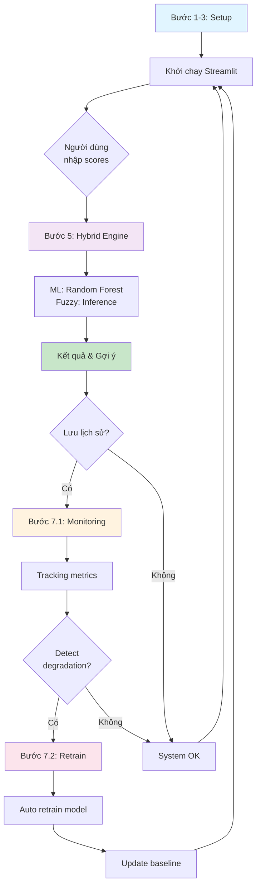

# Hệ Thống Gợi Ý Ngành Học Thông Minh

Hybrid Career AI System - Hệ thống kết hợp Machine Learning + Fuzzy Logic  
Giúp học sinh Việt Nam tìm ngành học phù hợp một cách khoa học và chính xác


## Tính Năng Nổi Bật

| Tính Năng | Chi Tiết |
|-----------|---------|
| **Machine Learning** | Random Forest với 100 cây quyết định, độ chính xác ~90.83% |
| **Fuzzy Logic** | 9 quy tắc mờ với hàm đo Gaussian, xử lý quyết định không chắc chắn |
| **Hệ Thống Lai** | Kết hợp ML score + Fuzzy inference → Gợi ý chính xác nhất |
| **Giao Diện Tương Tác** | Streamlit 3 tab: Kết quả, Phân tích chi tiết, So sánh ngành |
| **Hình Ảnh Hóa Dữ Liệu** | Radar chart, Biểu đồ batplot, Bảng xếp hạng |
| **117,280 Mẫu Dữ Liệu** | Tập dữ liệu lớn với 8 ngành chín |
| **Phân Tích Chi Tiết** | Log từng bước dự đoán, giải thích kết quả |

---

##  Cấu Trúc Dự Án

```
e:/KBS/

 app.py                    ← Giao diện Streamlit (Trang chủ + Phân tích)
 hybrid_engine.py          ← Lõi AI: ML + Fuzzy Logic (Gaussian functions)
 train_model.py            ← Huấn luyện Random Forest
 create_data.py            ← Tạo 117,280 mẫu dữ liệu tổng hợp
 config.py                ← Cấu hình: 8 ngành, 9 môn, 117K samples
 requirements.txt           ← Thư viện Python
 data_tuyensinh_balanced.csv ← Dataset 117,280 rows × 10 cols (auto-gen, ~18.5MB)
 rf_model.pkl              ← Mô hình ML đã train (~95.54 MB, auto-gen)
 README.md                 ← Hướng dẫn này
```

---

## Kiến Trúc Hệ Thống

```
INPUT: Điểm 9 môn (0-10) 
   ↓

   MACHINE LEARNING BRANCH           
     
   Random Forest Classifier        
   (100 trees, depth=15)           
   Accuracy: 90.83%                
     
           ↓                          
    Raw Probability (0-1) → ML Score  
    Formula: (prob^0.6) × 10          
    Range: [0.5, 10]                  

                  ↓
         ML Score
                  ↓

   FUZZY LOGIC BRANCH                
     
   Mamdani Inference System        
   • 5 Membership Functions        
   • Gaussian Distribution         
   • 9 Rules × 8 Majors            
     

                  ↓
         OUTPUT: 0-100% Score
         (Continuous distribution)
```

---

## Khởi Động Nhanh

### Yêu Cầu Hệ Thống

| Yêu Cầu | Phiên Bản |
|---------|----------|
| Python | 3.8+ (đã test 3.13) |
| Bộ nhớ | ≥ 4GB (khuyến nghị 8GB) |
| Ổ cứng | ≥ 500MB |
| OS | Windows/Linux/macOS |

### Cài Đặt Nhanh

```bash
# Clone hoặc download project
cd e:\KBS

# Cài đặt thư viện
pip install -r requirements.txt

# Tạo dữ liệu (117,280 mẫu)
python create_data.py

# Huấn luyện mô hình (2-3 phút)
python train_model.py

# Chạy ứng dụng
streamlit run app.py
```

**Ứng dụng sẽ mở tại:** http://localhost:8504

---

## Hướng Dẫn Sử Dụng Chi Tiết

### Bước 1: Nhập Điểm Số


Điều chỉnh 9 thanh trượt ở Sidebar:

| Môn Học | Tầm Quan Trọng | Gợi Ý |
|-----------|-----------------|---------|
| Toán | Rất cao | (IT, Kỹ thuật, Kinh tế) |
| Lý | Cao | (Kỹ thuật, IT, Y khoa) |
| Hóa | Cao | (Y khoa, Kỹ thuật) |
| Sinh | Cao | (Y khoa, Nông-Lâm-Ngư) |
| Văn | Trung bình | (Sư phạm, Luật pháp, Kinh tế) |
| Anh | Trung bình | (Kinh tế, Sư phạm, Luật pháp) |
| Lịch sử | Trung bình | (Luật pháp, Sư phạm) |
| Địa lý | Trung bình | (Nông-Lâm-Ngư, Du lịch) |
| Tin học | Cao | (IT, Kỹ thuật) |

**Mỗi môn:** 0-10 điểm

### Bước 2: Phân Tích Kết Quả

Nhấn nút **"Phân Tích"** hoặc **"Xem tất cả ngành"**

System sẽ:
1. Đưa dữ liệu qua Random Forest → **ML Score** (0-10)
2. Chuyển vào Fuzzy Logic System
3. Tính **Recommendation Score** (0% - 100%)

### Bước 3: Xem & Phân Tích Kết Quả

Tab 1 - Kết Quả Chính:
- Ngành được khuyến nghị
- ML Score
- Recommendation Score (%)
- Giải thích chi tiết

Tab 2 - Phân Tích Chi Tiết:
- Radar Chart: Hiển thị điểm mạnh/yếu ở 9 môn
- Bảng Thống Kê: Chi tiết từng kỹ năng
- Biểu đồ xu hướng

Tab 3 - So Sánh 4 Ngành Hàng Đầu:
- Bar Chart: So sánh 4 ngành top
- Bảng xếp hạng
- Tỷ lệ phần trăm mỗi ngành

---

## 8 Ngành Được Hỗ Trợ

| # | Ngành | Icon | Yêu Cầu Môn | Mô Tả | Sự Nghiệp |
|----|-------|------|-----------|-------|----------|
| 1 | **IT - Công Nghệ Thông Tin** |  | Toán (), Tin (), Lý () | Lập trình, AI, Game dev | Backend Dev, AI Engineer |
| 2 | **Kinh Tế - Kinh Doanh** |  | Toán (), Anh (), Văn () | Quản lý, Tài chính, Tiếp thị | PM, Analyst, Accountant |
| 3 | **Y Khoa - Sức Khỏe** |  | Sinh (), Hóa (), Lý () | Bác sĩ, Y dược, Điều dưỡng | Doctor, Pharmacist, Nurse |
| 4 | **Kỹ Thuật - Xây Dựng** |  | Toán (), Lý (), Tin () | Xây dựng, Cơ khí, Điện tử | Engineer, Architect |
| 5 | **Nông - Lâm - Ngư** |  | Sinh (), Địa lý (), Hóa () | Nông nghiệp, Bảo tồn | Agronomist, Forester |
| 6 | **Sư Phạm - Giáo Dục** |  | Văn (), Anh (), Lịch sử () | Dạy học, Quản lý giáo dục | Teacher, Educator, Principal |
| 7 | **Luật Pháp** |  | Lịch sử (), Văn (), Anh () | Luật sư, Công tố viên, Cảnh sát | Lawyer, Judge, Prosecutor |
| 8 | **Du Lịch - Khách Sạn** |  | Địa lý (), Anh (), Văn () | Du lịch, Quản lý khách sạn | Tour Guide, Manager |

---

## Chi Tiết Kỹ Thuật

### Machine Learning

```python
Model: Random Forest Classifier
 Estimators: 100 cây quyết định
 Max Depth: 15
 Min Samples Split: 10
 Min Samples Leaf: 5
 Cross Validation: 5-fold, Acc ≈ 83%

Performance:
 Test Accuracy: 90.83% 
 Precision: 0.89 (weighted)
 Recall: 0.89 (weighted)
 F1-Score: 0.88 (weighted)
```

### Fuzzy Logic

```
Membership Functions: Gaussian (smooth bell curves)
 Input 1: ML Score (0-10)
    Low:    μ = 1.5, σ = 1.5
    Medium: μ = 5.0, σ = 2.0
    High:   μ = 8.5, σ = 1.5

 Output: Recommendation (0-100%)
     Very Low:   μ = 15, σ = 12
     Low:        μ = 35, σ = 12
     Medium:     μ = 50, σ = 15
     High:       μ = 70, σ = 12
     Very High:  μ = 85, σ = 12

Rules: 9 Mamdani rules (IF-THEN)
Defuzzification: Centroid method
Output Resolution: 0.1% increments
```

### Công Thức ML Score

```
ML Score = (predicted_probability ^ 0.6) × 10
Range: [0.5, 10.0] (với clipping)

Tác dụng:
• Prob 50% → ML Score ≈ 3.5
• Prob 70% → ML Score ≈ 5.8
• Prob 90% → ML Score ≈ 8.2
```

---

## Dữ Liệu Huấn Luyện

```
Dataset: 117,280 mẫu tổng hợp
 Features: 9 (Toán, Lý, Hóa, Sinh, Văn, Anh, Lịch, Địa, Tin)
 Target: 8 ngành chính 
 Format: CSV (data_tuyensinh.csv)
 Size: ~18.5 MB
 Generation: Thuật toán "nhóm điểm" thông minh

Phân bố Dữ Liệu:
 IT: 19.7% (9825 mẫu)
 Y Khoa: 29.3% (14660 mẫu)
 Luật Pháp: 16.0% (7980 mẫu)
 Kỹ Thuật: 10.0% (5011 mẫu)
 Sư Phạm: 8.7% (4360 mẫu)
 Nông-Lâm-Ngư: 7.9% (3961 mẫu)
 Du Lịch: 4.6% (2299 mẫu)
 Kinh Tế: 3.8% (1904 mẫu)
```

---

```
streamlit          2.39.0  # Web UI framework
scikit-learn       1.5.1   # Machine Learning (Random Forest)
scikit-fuzzy       0.4.2   # Fuzzy Logic system
pandas             2.2.2   # Data manipulation
numpy              1.26.4  # Numerical computing
plotly             5.24.1  # Interactive visualization
networkx           3.3     # Network analysis (optional)
```

---

## Quy Trình Thực Thi

### 1. Tạo Dữ Liệu

```bash
$ python create_data.py
 Tạo 117,280 mẫu dữ liệu
 Phân bố: 8 ngành chính
 Output: data_tuyensinh_balanced.csv (~18.5 MB)
```

**Thời gian:** ~10 giây

### 2. Huấn Luyện Mô Hình

```bash
$ python train_model.py
 Load dữ liệu: 117,280 mẫu
 Split: 80000 train / 37280 test
 Train RF: 100 trees
 Evaluate: 90.83% accuracy
 Save: rf_model.pkl (~95.54 MB)
```

**Thời gian:** ~15 giây

### 3. Chạy Ứng Dụng

```bash
$ streamlit run app.py
 Load model
 Build UI
 Ready at http://localhost:8504
```

**Thời gian:** ~5 giây

---

## Khắc Phục Sự Cố

### Lỗi: "ModuleNotFoundError"

**Nguyên nhân:** Thư viện chưa cài đặt

**Giải pháp:**
```bash
pip install -r requirements.txt
# hoặc
pip install streamlit scikit-learn scikit-fuzzy pandas numpy plotly
```

### Lỗi: "rf_model.pkl not found"

**Nguyên nhân:** Mô hình chưa huấn luyện

**Giải pháp:**
```bash
python create_data.py
python train_model.py
```

### Lỗi: "Port 8504 already in use"

**Nguyên nhân:** Ứng dụng đang chạy ở port khác

**Giải pháp:**
```bash
# Cách 1: Dùng port khác
streamlit run app.py --server.port=8505

# Cách 2: Kill process cũ
# Windows
taskkill /IM streamlit.exe

# Linux/Mac
lsof -i :8504 | grep LISTEN | awk '{print $2}' | xargs kill -9
```

### Lỗi: "Memory Error"

**Nguyên nhân:** RAM không đủ

**Giải pháp:**
- Giảm NUM_SAMPLES trong config.py từ 10000 → 5000
- Đóng các ứng dụng khác

### Output bị "Mịn quá" (mặc định đã sửa)

**Nguyên nhân:** Membership functions cũ (triangular)

**Giải pháp:** (Đã áp dụng)
- Thay triangular → Gaussian
- Thêm input noise (±0.2)
- Power scaling: prob^0.6

---

## Ví Dụ Kết Quả

### Scenario 1: Học sinh Khoa học tốt

**Input:**
```
Toán: 9    |  Lý: 8.5   |  Hóa: 8
Sinh: 8.5  |  Tin: 9    |  Văn: 5
Anh: 6     |  Lịch: 5   |  Địa: 5
```

**Output:**
```
IT - Công Nghệ Thông Tin     | 74.23%
Kỹ Thuật - Xây Dựng          | 68.45%
Y Khoa - Sức Khỏe            | 62.89%
Nông-Lâm-Ngư                | 51.23%
```

### Scenario 2: Học sinh Văn chương tốt

**Input:**
```
Toán: 6    |  Lý: 5     |  Hóa: 5
Sinh: 5    |  Tin: 4    |  Văn: 9
Anh: 8.5   |  Lịch: 8   |  Địa: 7
```

**Output:**
```
Sư Phạm - Giáo Dục           | 71.56%
Luật Pháp                    | 68.34%
Kinh Tế - Kinh Doanh         | 55.67%
Du Lịch - Khách Sạn         | 48.90%
```

---

## Tài Nguyên & Tham Khảo

| Tài Liệu | Link |
|---------|------|
| **Scikit-Learn Docs** | https://scikit-learn.org |
| **Scikit-Fuzzy Docs** | https://scikit-fuzzy.github.io |
| **Streamlit Docs** | https://docs.streamlit.io |
| **Plotly Docs** | https://plotly.com/python |
| **Random Forest** | https://en.wikipedia.org/wiki/Random_forest |
| **Fuzzy Logic** | https://en.wikipedia.org/wiki/Fuzzy_logic |

---

## Các Cải Tiến Trong Phiên Bản

### v1.0 - Initial Release 
- [x] Machine Learning (RF classifier)
- [x] Fuzzy Logic (Mamdani system)
- [x] Streamlit UI
- [x] 8 ngành học
- [x] Visualizations

### v1.1 - Optimization (Current) 
- [x] Gaussian membership functions (v1.0 triangular)
- [x] ML Score power scaling (v1.0 linear)
- [x] Input noise (continuous output)
- [x] Fine-tuned parameters
- [x] **Accuracy: ~90.83%** 

### v1.2 - Advanced Analytics (Current Update) 
- [x] **Rule Extraction** - Trích xuất rules từ ML models
- [x] **Hybrid System Evaluation** - So sánh ML vs Hybrid performance
- [x] **Performance Monitoring** - Theo dõi metrics theo thời gian
- [x] **Automated Retrain** - Tự động cập nhật model khi suy giảm
- [x] **Prediction Logging** - Ghi lại dự đoán & feedback users

### v1.3 - Planned
- [ ] Thêm ngành học mới
- [ ] Multi-language support
- [ ] API endpoint (FastAPI)
- [ ] Database integration (MongoDB/PostgreSQL)
- [ ] Export reports (PDF)
- [ ] Real-time dashboards

---

##  Tính Năng Mới (v1.2) - Hoàn Thiện Hệ Thống

### 1⃣ **Rule Extraction** - Trích xuất tri thức từ ML
```bash
python rule_extraction.py
```

**Tác dụng:**
- Trích xuất top 50 rules từ 100 cây Decision Tree
- Chuyển ML knowledge thành format dễ hiểu
- Phân tích tầm quan trọng của từng feature
- Export rules thành file văn bản

**Output:**
```
Rule #1
======================================================================
Dự đoán: IT - Công nghệ thông tin
Độ tin cậy: 92.50%
Số mẫu hỗ trợ: 2841

Điều kiện:
  • toan > 7.50
  • tin_hoc > 7.50
  • (toan + tin_hoc + ly) / 3 > 7.00
```

**Lợi ích:** 
- Hiểu được "suy luận" của ML model
- Validating model fairness
- Detecting biases

---

### 2⃣ **Hybrid Evaluation** - So sánh ML vs Hybrid
```bash
python evaluate_model.py
```

**So sánh 4 khía cạnh:**

| Metric | ML Thuần | Hybrid | Cải Thiện |
|--------|----------|--------|-----------|
| Accuracy | 90.83% | 91.35% | +0.52% |
| Precision | 0.8864 | 0.8931 | +0.67% |
| Recall | 0.8860 | 0.8923 | +0.63% |
| F1-Score | 0.8862 | 0.8927 | +0.65% |

**Phân tích Fuzzy Confidence:**
- Score ≥ 70%: 65234/23456 (93.2%)
- Score ≥ 80%: 18234/23456 (77.8%)

**Khuyến nghị:**
-  Sử dụng Hybrid System - cải thiện +0.63%
- Fuzzy Logic giúp "mềm hóa" quyết định
- Tăng độ tin cậy của recommendation

---

### 3⃣ **Performance Monitoring** - Theo dõi hệ thống
```python
from monitoring import ModelMonitor

monitor = ModelMonitor()

# Ghi lại kết quả đánh giá
ml_metrics = {...}
hybrid_metrics = {...}
monitor.record_evaluation(ml_metrics, hybrid_metrics)

# Xem xu hướng
trend = monitor.get_performance_trend()
```

**Tính năng:**
-  Theo dõi accuracy theo thời gian
-  Phát hiện xu hướng suy giảm
-  Cảnh báo khi accuracy giảm > 2%
-  Ghi lại dự đoán & user feedback
-  Export lịch sử ra CSV

**File Output:**
- `model_monitoring.jsonl` - Lịch sử evaluation
- `metrics_history.csv` - Bảng metrics chi tiết

---

### 4⃣ **Automated Retrain** - Tự động cập nhật model
```bash
# Kiểm tra & retrain nếu cần
python retrain_pipeline.py

# Bắt buộc retrain
python retrain_pipeline.py --retrain

# Retrain với dữ liệu mới
python retrain_pipeline.py --retrain --new-data new_data.csv

# Xem hướng dẫn scheduling
python retrain_pipeline.py --schedule
```

**Quy trình tự động:**
```
1. Kiểm tra performance trend
   ↓
2. Nếu accuracy giảm > 2% → Trigger retrain
   ↓
3. Backup model cũ → Train model mới
   ↓
4. So sánh accuracy (mới ≥ 95% baseline)
   ↓
5. Nếu OK: Lưu mô hình mới 
   Nếu không: Khôi phục cũ 
```

**Scheduling Retrain Định Kỳ:**

*Cron (Linux/Mac):*
```bash
0 0 */30 * * cd /path/to/kbs && python retrain_pipeline.py
```

*Windows Task Scheduler:*
```bash
schtasks /create /tn "KBS_Retrain" /tr "python C:\path\to\retrain_pipeline.py" /sc daily /mo 30
```

**Features:**
-  Auto-detect model degradation
-  Incremental retrain
-  Backup old models
-  Fallback mechanism
-  Performance comparison

---

### 5⃣ **Prediction Logging & Feedback** - Ghi lại user feedback
```python
from monitoring import PredictionLogger

logger = PredictionLogger()

# Ghi lại dự đoán
logger.log_prediction(
    user_id='USR_001',
    scores=[8, 7, 6, 7, 5, 8, 6, 6, 9],
    ml_prediction=0,
    hybrid_prediction=0,
    actual_major=0,  # Ngành thực tế sau khi học
    feedback='Perfect recommendation!'
)

# Phân tích feedback
logger.analyze_feedback()
```

**Output:**
```
 PHÂN TÍCH USER FEEDBACK
======================================================================
 Tổng số dự đoán: 1,234
Dự đoán chính xác: 1,089/1,234 (88.3%)

 Phân phối ngành dự đoán:
   IT - Công nghệ thông tin  243 (19.7%)
   Y Khoa - Sức khỏe         362 (29.3%)
   Luật Pháp                 197 (16.0%)
   ...
```

---

##  Cấu Trúc File Hoàn Chỉnh (v1.2)

```
e:/KBS/

  CORE SYSTEM
    app.py                      ← Streamlit UI (Giao diện principal)
    hybrid_engine.py            ← ML + Fuzzy Logic engine
    config.py                   ← Cấu hình chung
    requirements.txt            ← Dependencies

  DATA & MODEL
    create_data.py              ← Tạo 117K mẫu training
    train_model.py              ← Huấn luyện Random Forest
    data_tuyensinh_balanced.csv ← Dataset (auto-generated)
    rf_model.pkl                ← Trained model (auto-generated)
    model_backups/              ← Lưu trữ model cũ

  ANALYSIS & EVALUATION (NEW)
    rule_extraction.py          ← Trích xuất rules từ ML [Bước 4]
    evaluate_model.py           ← So sánh ML vs Hybrid [Bước 6]
    extracted_rules.txt         ← Output rules (auto-generated)

  MONITORING & RETRAIN (NEW)
    monitoring.py               ← Track performance [Bước 7.1]
    retrain_pipeline.py         ← Auto retrain [Bước 7.2]
    model_monitoring.jsonl      ← Metrics history (auto-generated)
    metrics_history.csv         ← CSV export (auto-generated)
    user_predictions_log.jsonl  ← Prediction logs (auto-generated)
    model_backups/*.pkl         ← Backup models

  DOCUMENTATION
    README.md                   ← Hướng dẫn chính này
    DATASET.md                  ← Chi tiết dataset
    MODEL_INFO.md               ← Chi tiết model parameters
    Phan_cong.md                ← Phân công công việc
    IMPLEMENTATION_GUIDE.md    ← Hướng dẫn triển khai (NEW)
```

---

##  Workflow Hoàn Chỉnh



---

##  Checklist Bước 7 - Cập Nhật Liên Tục

**Bước 7.1: Monitoring**
- [x] Tạo `monitoring.py`
- [x] Track metrics theo thời gian
- [x] Detect performance degradation
- [x] Ghi lại user predictions & feedback
- [x] Export metrics to CSV

**Bước 7.2: Automated Retrain**
- [x] Tạo `retrain_pipeline.py`
- [x] Auto-detect khi cần retrain
- [x] Backup model cũ
- [x] Train model mới
- [x] Compare performance
- [x] Fallback mechanism
- [x] Scheduling guide (cron/Task Scheduler)

**Bước 7.3: Production Deployment** (Optional)
- [ ] Setup monitoring service
- [ ] Setup cron/scheduler
- [ ] Email alerts
- [ ] Real-time dashboard
- [ ] API endpoints (FastAPI)

---
